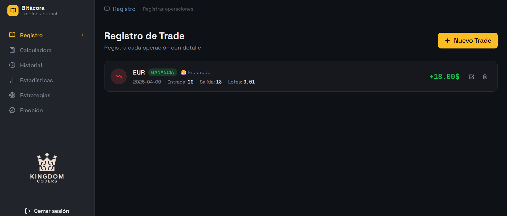

# Bitácora de trading

Aplicación web para registrar, analizar y mejorar operaciones de trading.
Permite a los usuarios llevar un control detallado de sus trades y tomar decisiones
basadas en datos.

## Demo
https://bitacora-one.vercel.app

## Capturas

## Funcionalidades

### Autenticación
- Registro e inicio de sesión de usuarios.
- Manejo de sesiones con supabase.

### Módulos principales
- Registro de trade.
- Calculadora de riesgo.
- Historial de operaciones.
- Estadisticas.
- Gestión de estrategias.
- Registro emocional del trader.

## Tecnologias
- React.
- TailwindCSS.
- Supabase (autenticación y base de datos).
- Vite.
- Deploy en vercel

## Estado del proyecto
En desarrollo activo.

Actualmente se están mejorando las funcionalidades de analisis y visualización de datos, 
asi como la experiencia del usuario.

## Contexto
Este proyecto está siendo desarrollado para un usuario real, con mejoras
continuas basadas en sus necesidades. El objetivo es construir una herramienta practica
que ayude a mejorar la toma de decisiones en el trading.

## Instalación
1. Clonar el repositorio:
https://github.com/santiago9007/bitacora.git

2. Instalar dependencias:
npm install

3. Ejecutar:
npm run dev

## Autor

David Santiago Diaz Román